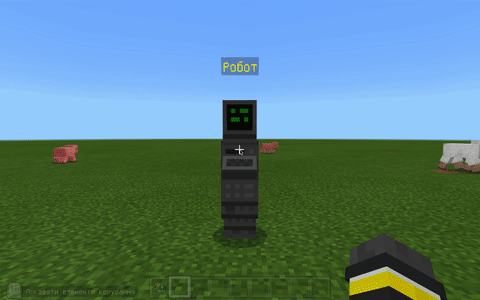
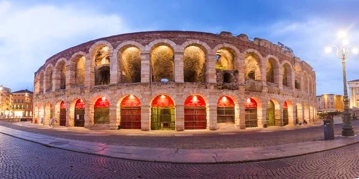

# Власні проєкти

#### Опис


Сьогодні ми нарешті використаємо отримані нами на попередніх заняттях навички на фінальному проекті модуля🎊 🎉


## Згадаймо🤔

1. Що таке функція і навіщо вона потрібна?&#x20;
2. Що таке цикли і навіщо вони потрібні?&#x20;
3. Які дива світу ми побудували за весь цей час?

## Сьогодні ви:

1. Використовуючи зображення споруди та вже отримані навички, самостійно створите репліку обраної вами архітектурної пам'ятки.
2. Проведете екскурсію по створеному об'єкту, розставивши по місцях екскурсії NPC.

## Неігрові персонажі та команди до них

1. Створення неігрового персонажу.
2. Команди до неігрових персонажів.
3. Огорожа простору бою (телепортація в сітку і боротьба із мобами)

### Телепорт

| **№**         | **1**                                                                                                                                                                                                                                                                                                       |
| ------------- | ----------------------------------------------------------------------------------------------------------------------------------------------------------------------------------------------------------------------------------------------------------------------------------------------------------- |
| **Завдання**  | <ol><li>При введенні в чат команди teleport, телепортуватися в точку <strong>(0;4;30)</strong>.</li><li>При введені в чат команди teleport, телепортуватися в точку <strong>(10;4;30)</strong>.</li><li>При введені в чат команди teleportup, телепортуватися в точку <strong>(0;14;30).</strong></li></ol> |
| **Код**       | .png>)                                                                                                                                                                                                                                                                       |
| **Результат** | .png>)                                                                                                                                                                                                                                                                       |

### Огорожа

| **№**         | 2                                                                                                                                                          |
| ------------- | ---------------------------------------------------------------------------------------------------------------------------------------------------------- |
| **Завдання**  | <ol><li>Увести в чат команду <strong>border,</strong> побудувати огорожу від точки <strong>(0;4;30)</strong> до точки <strong>(10;4;40)</strong></li></ol> |
| **Код**       | .png>)                                                                                                                      |
| **Результат** | .png>)                                                                                                                      |

### Огорожа з телепортом

| **№**         | **3**                                                                                                                                                                                                                                        |
| ------------- | -------------------------------------------------------------------------------------------------------------------------------------------------------------------------------------------------------------------------------------------- |
| **Завдання**  | 

<ol><li>Увести в чат команду <strong>start,</strong> побудувати огорожу від точки <strong>(0;4;30)</strong> до точки <strong>(10;4;40)</strong> і телепортуватися в точку <strong>player.teleport(world(0, 4, 30))</strong></li></ol> |
| **Код**       | .png>)                                                                                                                                                                                                        |
| **Результат** | .png>)                                                                                                                                                                                                         |

## Створити NPC

| №  | Дія                                                                                                              | Результат                                                                                                                                                                    |
| -- | ---------------------------------------------------------------------------------------------------------------- | ---------------------------------------------------------------------------------------------------------------------------------------------------------------------------- |
| 1  | Переключемо режим «Творець світу» в положення «Так» — в чаті дамо команду /wb                                    |      |
| 2  | В інвентарі знайдемо яйце призову NPC                                                                            |      |
| 3  | Додамо яйце призову NPC в свою комірку                                                                           |      |
| 4  | Використаємо яйце призову NPC, натиснувши правою клавішою миші, за умови, що яйце знаходиться в активній комірці |      |
| 5  | Оберемо ім'я NPC (поле 1) та оберемо скін (поле 3)                                                               |      |
| 6  | Введемо текст, який буде виводити NPC (поле 2 на попередньому зображенні)                                        |      |
| 7  | Після завершення дій закриємо вікно                                                                              |      |
| 8  | Переключимо режим «Творець світу» в положення «Ні» — в чаті дамо команду /wb                                     |  |
| 9  | Побачимо NPC                                                                                                     |      |
| 10 | При натисканні правої клавіші миші на NPC побачимо інформаційне повідомлення                                     |      |

## Творче завдання

1. Додайте NPC, який описує вашу гру, створену на попередньому занятті (в тому числі — які команди можна натискати)

## Супертворче завдання

1. Поєднайте це заняття із попереднім (щоб гра стартувала не просто з появи негативних мобів, а також щоб створювалася клітка для битви, і гравця переносило в цю клітку).

### Команди NPC

NPC може не тільки писати текст, але й відображати команди.

Для підготовки команди варто відпрацювати її в чаті:\

У NPC натиснемо «Додаткові функції»\
\
Оберемо поле «Команда»\

Додамо код (наприклад, телепорту)\

### Отримати інвентар

За допомогою NPC (або командами) можна надати інвентар гравцю. Протестуємо команду передачі алмазного меча найближчому гравцю:

`/give @p diamond_sword`

`/give` — команда передачі предмета гравцю&#x20;

`@p` — найближчему гравцеві&#x20;

`diamond_sword` — алмазного меча&#x20;

(замість @p можна вказати ім'я гравця)

### Кнопка з отримання інвентаря

Увімкнемо режим «Творець світу»\

Зайдемо в NPC та оберемо меню «**Розширені параметри»**\

Включимо «Режим кнопки» та додамо команду отримання меча\

| **№**         | **4**                                                                                                                                                                                                                                                                      |
| ------------- | -------------------------------------------------------------------------------------------------------------------------------------------------------------------------------------------------------------------------------------------------------------------------- |
| **Завдання**  | <ol><li>Додайте NPC, кнопку «Взяти меч», що надає гравцеві алмазний меч.</li><li>Додайте NPC, кнопку «Отримати лук та стріли», що надає гравцеві лук (bow) та стріли (arrow).</li><li>Додайте NPC, кнопку «Отримати тризуб», що надає гравцеві тризуб (trident).</li></ol> |
| **Код**       | .png>)                                                                                                                                                                                                                                       |
| **Результат** |                                                                                                                                                                                                                                              |

\
Тепер вам потрібно вибрати **одну** з 5 наведених нижче стародавніх будівель і створити її репліку в світі Minecraft, використовуючи отримані знання й навички!

Після створення свого проєкту потрібно зробити так, щоб **NPC розповів про вашу споруду**, зробив екскурсію по ньому\

## 1. Велика Китайська стіна


Низка кам'яних та земляних укріплень у північній частині Китаю, збудованих з метою захисту північних кордонів Китайської імперії від вторгнень різних кочових племен.

Найстаріша частина була збудована ще в **7 столітті до н.е.**

Її загальна протяжність згідно з результатами 2012 року становить **21 196,18 кілометрів**



За легендою, напрямок і місце побудови стіни робітникам вказав величезний **дракон**. Він пройшов уздовж кордонів країни, а робітники звели стіну на місці його слідів. Деякі стверджують, що навіть сама форма, яку утворила стіна, має схожість з драконом.


Використовуючи всі отримані на наших заняттях знання, ви можете побудувати свою Велику стіну!

1\. Збудувати сторожову вежу

2\. Збудувати багато-шарову стіну:

* Зовнішній шар блок: кам’яна цегла
* Внутрішній шар: гравій(верхній шар), булижник(середній шар), камінь (нижній шар) &#x20;

3\. Збудувати сигнальний маяк&#x20;

\

.png>)

.png>)

## 2. Веронська арена (_Arena di Verona)_


**Античний римський амфітеатр** (_антична споруда для різних масових видовищ; овальна арена, навколо якої уступами розташовувалися місця для глядачів_), побудований в Вероні (Італія) близько 30 року нашої ери, відомий як пам'ятник давньоримської архітектури та як місце проведення щорічних оперних фестивалів.&#x20;

Розташований на головному майдані міста — п'яцца-Бра.

У 2000 році амфітеатр був включений до числа пам'яток Світової спадщини ЮНЕСКО в складі історичного центру Верони



Амфітеатр складався із чотирьох еліптичних кілець. Первісний фасад був облицьований білим і рожевим вапняком із Вальполічелли. Збережений фасад амфітеатру виконаний з каменю, цементу, річкової гальки й шматків цегли.


На офіційному сайті амфітеатру можна зробити [віртуальну екскурсію](https://tourverona.com/tour/arena/tour.html)🤩

1. Збудувати сцену для листав&#x20;
2. Збудувати Коло висотою 20 блоків з радіусом 20 блоків&#x20;
3. Збудувати Сходи шириною 10 блоків і висотою 15 блоків&#x20;

.png>)

## 3. Стоунгендж


**Стоунге́ндж** або **Стовнгендж** (англ. _Stonehenge_, від староанглійського _Stan Hengues_ — «Висячі Камені») — мегаліт, що складається з кількох кіл із велетенських (до 8,5 м висотою) каменів.&#x20;

Розташований в Англії на горбистій пустці поблизу міста Солсбері за 130 км від Лондона.&#x20;

Почав будуватися близько 3000 року до н. е. та набув сталого вигляду приблизно в 2500 році до н. е.



Легенди пов'язували споруду Стоунхенджа з ім'ям _**Мерліна** (наставник і радник короля Артура)_.&#x20;

У середині XVII століття англійський архітектор Ініго Джонс висунув версію, що Стоунхендж звели _**стародавні римляни**_.&#x20;

Деякі вчені середніх віків вважали, що Стоунхендж побудували швейцарці або німці.&#x20;

На початку XIX століття утвердилася версія про Стоунхендж, як про святилище _**друїдів**_.

Деякі вважали, що це гробниця Боадіцеї — язичницької королеви.

Ще автори XVIII століття помітили, що положення каменів можна пов'язати з астрономічними явищами — як грандіозної **обсерваторії кам'яного віку**

Ця споруда настільки давня і оповита легенда, що достовірно складно сказати, чому ж вона була побудована!


1. Збудувати два кола висота кіл 7 блоків один з діаметром 15 блоків інший 10 блоків, менше з кіл має знаходитися в середині більшого&#x20;
2. Збудувати коло висота 7 блоків з діаметром 15 блоків з прорізом через один блок висотою 6 блоків &#x20;

.png>)

.png>).png>)

## 4. Парфенон


Головний храм Афінського акрополя, присвячений богині Афіні Парфенос, покровительці міста та всієї Аттики; визначна пам'ятка давньогрецького мистецтва.

Помпезний храм збудували з мармуру на вершині гори в 447 – 437 роках до н.е в подяку Афіні Парфенос, за сприяння в запеклій боротьбі з персами, що завершилася тріумфом греків в марафонській битві.



Фасад був прикрашений барельєфами, що зображують сцени єдиноборств: битва лапіфів і кентаврів — зі східного боку, греків і амазонок — з Південної, богів і гігантів — на півночі, і учасників Троянської війни — на заході.&#x20;

Скульптурна композиція на східному фронтоні присвячена міфу про народження Афіни. Як і належить богиням, Афіна з'явилася на світ незвичайним чином, а саме — з голови Зевса.&#x20;

**Легенда свідчить**: Зевс проковтнув вагітну дружину, щоб запобігти народженню сина, який би повалив його з трону. Незабаром бог-громовержець відчув сильний біль, і тоді коваль Гефест вдарив його по голові, і звідти вистрибнула Афіна.


1. Збудувати фундамент з тесаного піщаника висотою в два блоки з плавний переходом (потрібно використати сходи)
2. Збудувати 6 колон які стоять в один ряд з однаковим інтервалом один від одної &#x20;
3. Збудувати трикутний дах (рівнобедреної форми)

.png>)

.png>)

## 5. Римська дорога


Дорожня мережа, створена римлянами для швидкого пересування **військ, торгових караванів** і **кур'єрів**.

Найчастіше це були відносно прямі дороги між важливими населеними пунктами, що давало можливість швидко переміститися в необхідне місце. Римські дороги зв'язали між собою багато міст в Італії, потім почали з'являтися і на інших територіях Римської імперії між значущими політичними та економічними центрами. Спочатку дороги будувалися у військових цілях, але потім стали відігравати значну роль в економічному розвитку імперії.



Будівельники шарами укладали різні матеріали, які можливо було добути в околицях:

1. **Statumen («підпора, устій»)** — основа дороги, яка формувалася з великих необроблених кам'яних блоків. Вони служили фундаментом дороги.&#x20;
2. **Rudus** («уламки каменів, щебінь») або nucleus («ядро, тверда серцевина») — шар піску або тонкий шар гравію, який клався на поверхню для того, щоб вирівняти поверхню.&#x20;
3. **Summum dorsum (верхня поверхня)** — верхній шар з дрібного піску, гравію, вапна або землі. Цей шар повинен був бути одночасно м'яким і міцним.&#x20;

Римські дороги рідко мостилися, за винятком тих ділянок, які знаходилися біля міст.

Побудована дорога мала дещо вигнуту поверхню, що дозволяло дощовій воді стікати в дренажні канави, вириті вздовж дороги.&#x20;

Переважно дорогами користувалися війська, тому іноді паралельно пролягав ще один **шлях для пішоходів** і **вершників**.


1. Зробити дорогу багатошаровою (мінімум 4 шари)
2. Зробити біля дороги канави для відтоку дощової води
3. Зробити колійні стовпи

.png>)

.png>).png>)

.png>)

